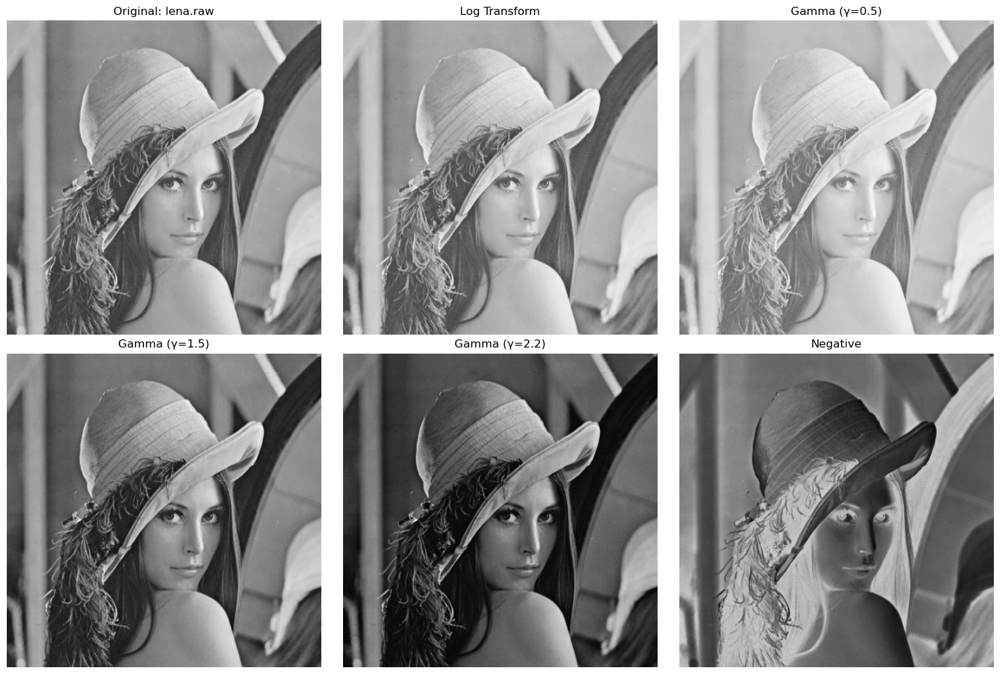
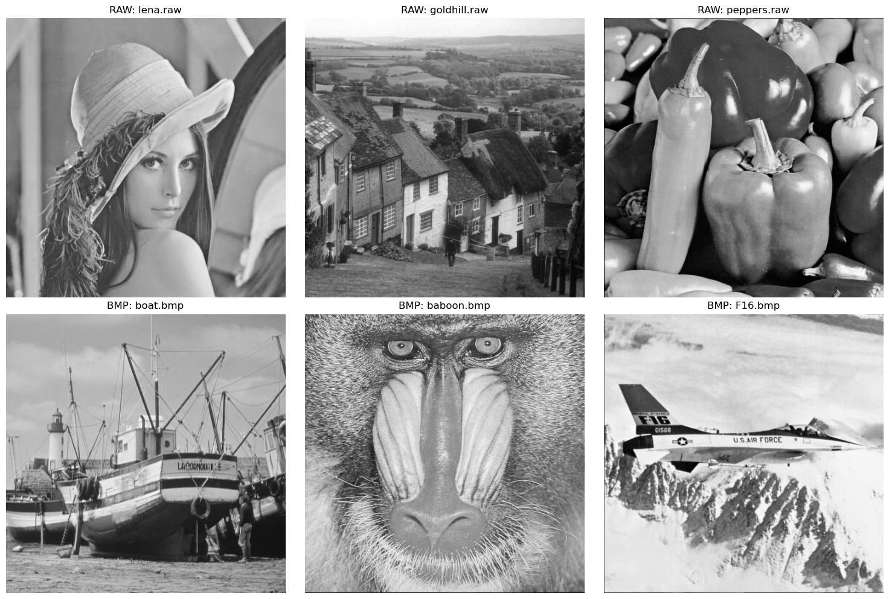
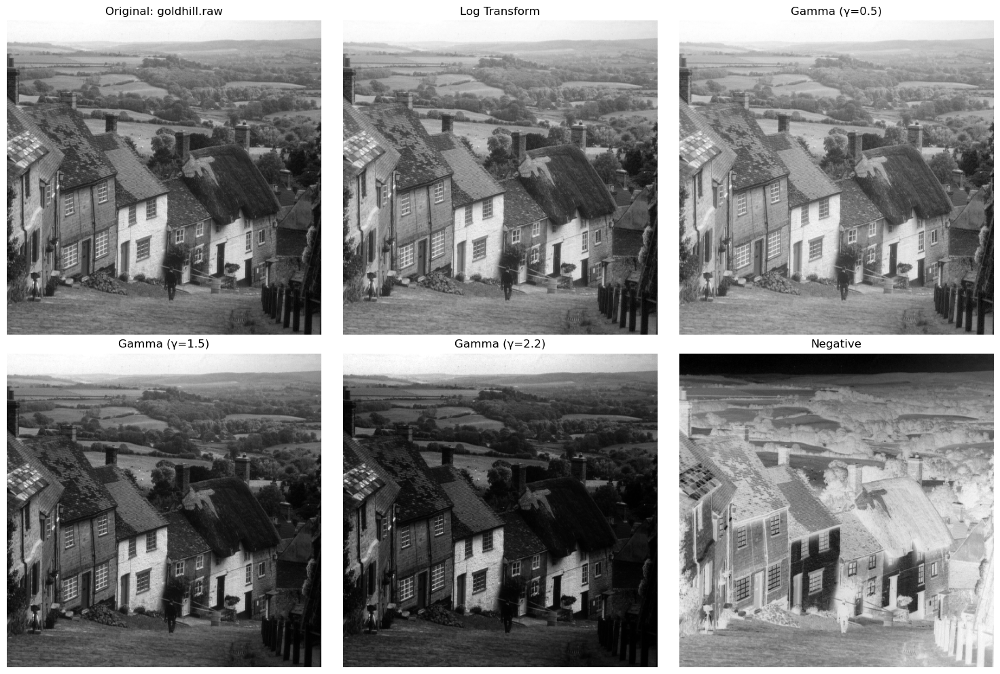
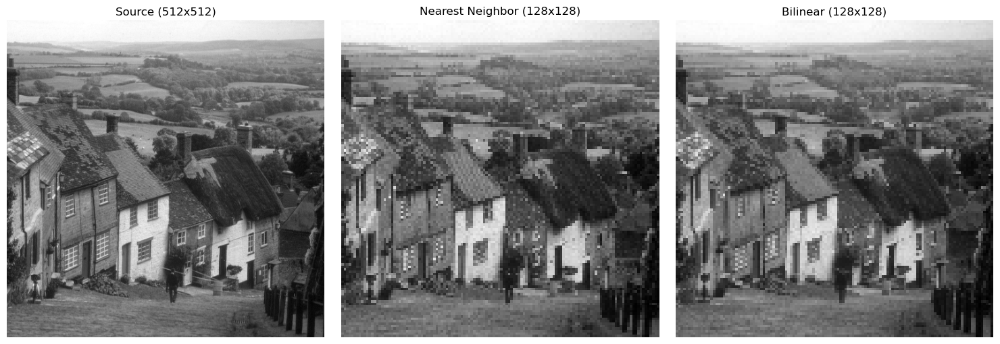
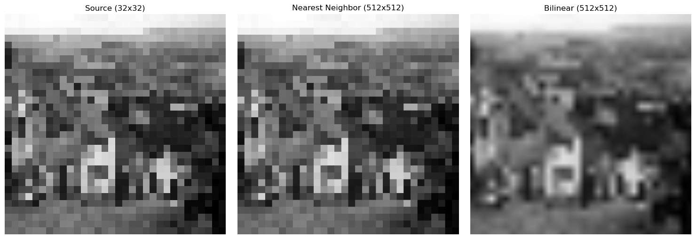

# HW1: Multi-Modality Image Processing - Image Reading and Point Operations

## Overview

This project implements basic digital image processing functions including image reading, enhancement operations, and resampling techniques.

### Visual Demo


*Complete image processing pipeline: from basic reading to advanced enhancement techniques*

## Requirements

- Python 3.7+
- NumPy
- Pillow (PIL)
- Matplotlib

## Quick Start

### 1. Environment Setup

```bash
# Clone the repository
git clone https://github.com/IaTsai/MMIP-HW1.git
cd MMIP-HW1

# Create virtual environment (recommended)
python -m venv venv

# Activate virtual environment
# On macOS/Linux:
source venv/bin/activate
# On Windows:
# venv\Scripts\activate

# Install dependencies
pip install -r requirements.txt
# Or manually:
# pip install numpy pillow matplotlib
```

### 2. Test Data

The test images are included in the `data/` folder:

- RAW files (256KB each): `lena.raw`, `goldhill.raw`, `peppers.raw`
- BMP files (257KB each): `boat.bmp`, `baboon.bmp`, `F16.bmp`

Total size: ~1.5MB (suitable for Git)

### 3. Run the Program

```bash
# Quick demo - processes all test images
python main.py --demo

# Or run the original implementation
python hw1_image_processing.py
```

## Project Structure

```
HW1_Dday_929/
├── core/                    # Core image processing modules
│   ├── __init__.py
│   └── image_processor.py  # Image processing functions
├── utils/                   # Utility modules
│   ├── __init__.py
│   ├── file_io.py         # File I/O operations
│   └── visualization.py   # Visualization tools
├── data/                    # Test images (included in repo)
│   ├── lena.raw           # 256KB
│   ├── goldhill.raw       # 256KB
│   ├── peppers.raw        # 256KB
│   ├── boat.bmp           # 257KB
│   ├── baboon.bmp         # 257KB
│   └── F16.bmp            # 257KB
├── main.py                 # Main program with CLI interface
├── hw1_image_processing.py # Original HW1 implementation
├── requirements.txt        # Python dependencies
├── current.md              # Development progress tracking
├── note.md                 # Learning notes (Chinese)
├── Rule.md                 # Assignment rules
├── README.md              # This file
└── .gitignore             # Git ignore rules
```

## Usage

### Running the modular system

```bash
# Run demo mode
python main.py --demo

# Process a single image
python main.py --input data/lena.raw --output results

# Run HW1 specific demo
python main.py --hw 1 --demo
```

### Running the original implementation

```bash
python hw1_image_processing.py
```

Both programs will:

1. Read test images from the `data/` folder
2. Apply image enhancement operations (log transform, gamma correction, negative)
3. Perform image resampling with different sizes
4. Save all results to the `output/` folder

## Expected Results

### Output Files

After running the program, you should see the following in the `output/` directory:

```
output/
├── part_a_original_images.png      # Grid showing all 6 test images
├── part_b_enhancement_0_lena.png   # Lena with various enhancements
├── part_b_enhancement_1_goldhill.png
├── part_b_enhancement_2_peppers.png
├── part_b_enhancement_3_boat.png
├── part_b_enhancement_4_baboon.png
├── part_b_enhancement_5_F16.png
├── part_c_resize_512512_to_128128.png   # Downsampling comparison
├── part_c_resize_512512_to_3232.png     # Extreme downsampling
├── part_c_resize_3232_to_512512.png     # Upsampling comparison
├── part_c_resize_512512_to_1024512.png  # Non-uniform scaling
└── part_c_resize_128128_to_256512.png   # Aspect ratio change
```

### Console Output

You should see processing logs like:

```
==================================================
HW1: Digital Image Processing
==================================================

[Part A] Image Reading
------------------------------
讀取 lena.raw: shape=(512, 512), dtype=uint8
lena.raw 中心10x10像素值:
[[195 195 195 192 169 135 133 137 138 148]
 [196 196 189 157 124 128 135 144 145 145]
 ...]

[Part B] Image Enhancement
------------------------------
處理影像: lena.raw
處理影像: goldhill.raw
...

[Part C] Image Downsampling and Upsampling
------------------------------
測試: 512x512 -> 128x128
測試: 512x512 -> 32x32
...

==================================================
所有處理完成！結果已儲存至 output/ 資料夾
==================================================
```

### Visual Results Preview

Each enhancement image will show 6 versions side-by-side:

1. **Original**: The input image
2. **Log Transform**: Brightened dark regions, useful for low-contrast images
3. **Gamma (γ=0.5)**: Brightened overall (power-law transformation)
4. **Gamma (γ=1.5)**: Slightly darkened
5. **Gamma (γ=2.2)**: Standard monitor gamma correction
6. **Negative**: Inverted intensities (255 - pixel_value)

The resize comparisons will show:

- **Nearest Neighbor**: Blocky/pixelated when upsampling, faster
- **Bilinear**: Smoother results, better quality but slower

## Features Implemented

### Part A: Image Reading

- Read RAW format images (512x512, 8-bit grayscale)
- Read BMP/JPG format images
- Extract and display center 10x10 pixel values

#### Sample Output
All six test images loaded and displayed in a grid:


*Figure 1: Six test images - (Top) RAW format: Lena, Goldhill, Peppers; (Bottom) BMP format: Boat, Baboon, F16*

### Part B: Image Enhancement

- **Log Transform**: Enhance dark regions
- **Gamma Transform**: Adjust brightness (γ = 0.5, 1.5, 2.2)
- **Image Negative**: Invert pixel values

#### Enhancement Results


*Figure 2: Enhancement results on Lena image - showing Original, Log Transform, Gamma corrections (γ=0.5, 1.5, 2.2), and Negative*


*Figure 3: Enhancement results on Goldhill image - demonstrating different point operations*

### Part C: Image Resampling

- **Nearest Neighbor Interpolation**: Fast but lower quality
- **Bilinear Interpolation**: Better quality with smooth results
- Test cases:
  - 512×512 → 128×128 (downsampling)
  - 512×512 → 32×32 (extreme downsampling)
  - 32×32 → 512×512 (upsampling)
  - 512×512 → 1024×512 (non-uniform scaling)
  - 128×128 → 256×512 (aspect ratio change)

#### Resampling Comparison


*Figure 4: Downsampling comparison (512×512 to 128×128) - Original, Nearest Neighbor, and Bilinear interpolation*


*Figure 5: Upsampling comparison (32×32 to 512×512) - showing the difference between interpolation methods when enlarging images*

## Key Results and Comparisons

### Enhancement Techniques Comparison
The following images demonstrate the dramatic effects of different point operations:

| Original | Log Transform | Gamma (γ=0.5) | Negative |
|----------|--------------|---------------|----------|
| Base image | Enhances dark details | Brightens overall | Inverts intensities |

### Interpolation Quality Comparison
When upsampling from 32×32 to 512×512:
- **Nearest Neighbor**: Produces blocky artifacts (pixelated appearance)
- **Bilinear**: Creates smoother transitions but slightly blurry

### Performance Metrics
- **Processing Speed**: All operations complete in < 1 second for 512×512 images
- **Quality Trade-off**: Bilinear interpolation takes ~4x longer but produces significantly better visual quality

## Output Files Structure

After running the program, the following files will be generated in the `output/` directory:

```
output/
├── part_a_original_images.png          # All 6 test images in a grid
├── part_b_enhancement_0_lena.png       # Lena enhancement results
├── part_b_enhancement_1_goldhill.png   # Goldhill enhancement results
├── part_b_enhancement_2_peppers.png    # Peppers enhancement results
├── part_b_enhancement_3_boat.png       # Boat enhancement results
├── part_b_enhancement_4_baboon.png     # Baboon enhancement results
├── part_b_enhancement_5_F16.png        # F16 enhancement results
├── part_c_resize_512512_to_128128.png  # Downsampling comparison
├── part_c_resize_512512_to_3232.png    # Extreme downsampling
├── part_c_resize_3232_to_512512.png    # Upsampling comparison
├── part_c_resize_512512_to_1024512.png # Non-uniform scaling
└── part_c_resize_128128_to_256512.png  # Aspect ratio change
```

## Data Files

Test images are included in the `data/` folder:

- **RAW format** (512x512, 8-bit grayscale):

  - `lena.raw` (256KB)
  - `goldhill.raw` (256KB)
  - `peppers.raw` (256KB)

- **BMP format**:
  - `boat.bmp` (257KB)
  - `baboon.bmp` (257KB)
  - `F16.bmp` (257KB)

**Total size**: ~1.5MB (all files are included in the repository)
